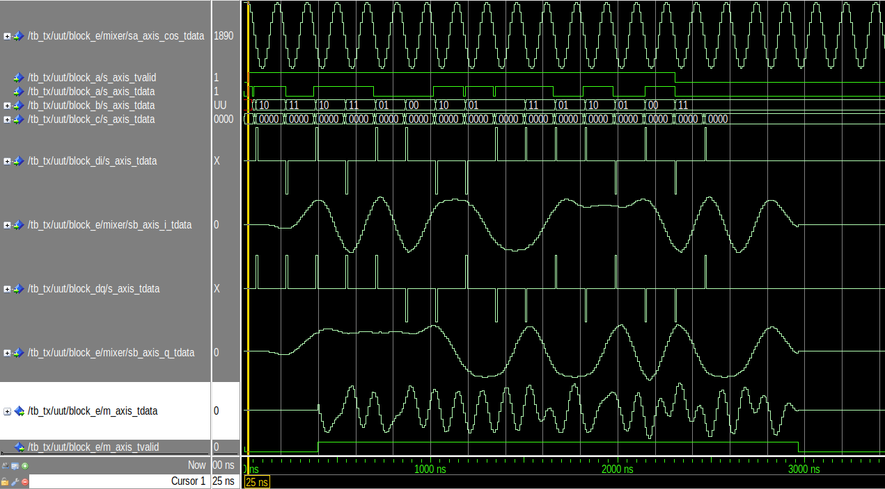
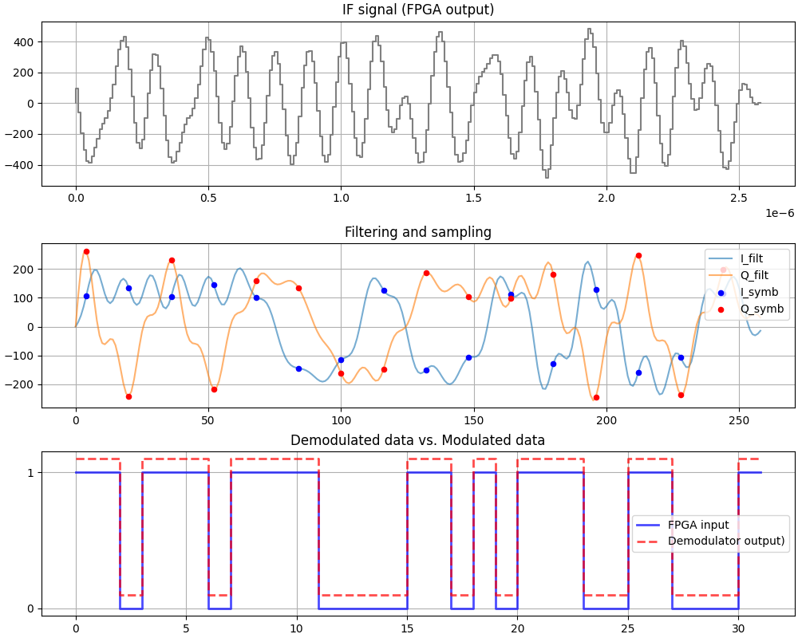

# FPGA QPSK Transmitter (VHDL/DSP)

## Table of Contents
1. [Introduction](#introduction)
2. [Project Architecture](#architecture)
3. [Demonstration](#demonstration)
4. [Tests](#test)
5. [How to Run](#how-to-run)

## Introduction
This project focuses on the design and implementation of a digital transmitter on an FPGA with QPSK modulation.

The primary objective is to apply fundamental concepts of DSP and digital communication using VHDL with AXI Stream interfaces, in an automated testing environment (VUnit, Makefile, TCP scripts, Python scripts).

## Architecture
### Transmitter Architecture
The design is structured around the following modules:
* **Symbol Generator:** Maps input data to the required symbols.
* **Upsampler:** Insert zero-padding between samples.
* **FIR Filter (RRC):** Performs pulse shaping to limit spectral occupancy and reduce Inter-Symbol Interference (ISI).
* **NCO:** Generates a sine/cosine based on an LUT containing a quarter of sine. 
* **Mixer:** Quadrature (I/Q) modulation for RF transmission.
### Others
* **TCL script:** Setup Modelsim, waves and their format then run the testbench.
* **Timing Control:** Manages valid/ready signals using AXI Stream interfaces.
* **VUnit tests:** Unit test for each entity separately.

## Demonstration
The results below validate the functionality of the transmission chain:

**Figure 1: Signals**

*This Figure show the signal evolution through the pipeline.*

We observe the evolution of the input serial data though the following blocks:
* **Block A:** Parrallelize 2 bits.
* **Block B:** Map the 2 bits onto QPSK symbols.
* **Block C:** Zero-padding (8 bits).
* **Block D:** FIR filter to avoid ISI and reduce bandwidth.
* **Block E:** Mix BLOCK D signal with NCO sine/cosine.

**Figure 2: Demodulator (Python)**

*This Figure shows the signal evolution through the Python demodulator.*

Based on a simple demodulator in Python, we can validate the FPGA simulation checking that the signal modulated by the FPGA can indeed be demodulated. We observe that the decoded data corresponds to the data sent to the FPGA.

## How to Run

### Prerequisites
* ModelSim
* Python
* VUnit

### Makefile
* **RRC FIR:** Modify *scripts/rrc/_fir_generator.py* then run *make rrc* to get FIR coefficients
* **Total:** Run *make* to compile VHDL files, execute all VUnit tests, and shows the global testbench with Modelsim (executes run.do).
* **Parts:** Run *make compile* (uses vcom), *make test* (executes VUnit), *make sim* (executes TCL) to run parts separately.
* **Analysis:** Run *make fft RUN_NAME=out/iqfir* to get a python analysis of the FPGA output. It first run *simu* and log data, then a data converter is run to get a csv. Finally the fft run using these data. Choose *out* for transmitter output, *iqfir* for filtered basedband signal.